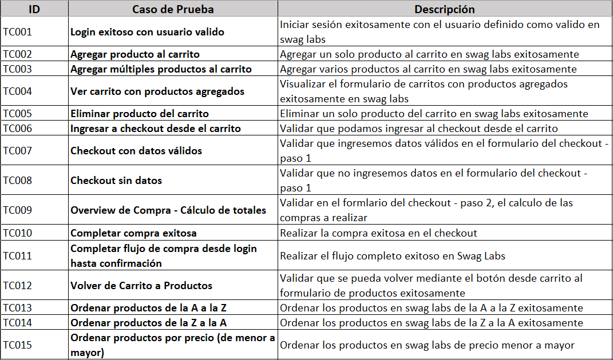

# Sauce Demo - Swag Labs | Playwright y Pytest

Proyecto de automatización de pruebas E2E para la aplicación Sauce Demo, desarrollado con Playwright, Python y Pytest.

# Tecnologías utilizadas
- Python 3.11+
- Playwright
- Pytest
- Pytest Playwright
- Page Object Model

# Estructura del proyecto
'''
swags-labs-playwright/
│
├── 📂pages/
│   ├── base_page.py
│   ├── cart_page.py
│   ├── checkout_page.py
│   ├── confirmation_page.py
│   ├── login_page.py
│   └── products_page.py
│
├── 📂tests/
│   ├── test_cart.py
│   ├── test_checkout.py
│   ├── test_e2e.py
│   └── test_login.py
│   └── test_products.py
|
├── 📂reports/
│   ├── report.html
│
├── 📂screenshots/
│
├── conftest.py
├── pytest.ini
├── requirements.txt
├── .gitignore
└── README.md
'''

# Implementaciones a futuro

- Reportes con Allure.
- Integración con Github Action mediante CI/CD.

# Casos de Prueba implementados

# Autor

Cristopher Gerardo Gaytán Díaz - QA Tester
